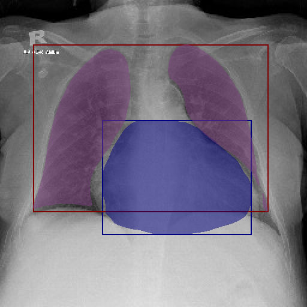

# Semantatic segmentation trainer

Heart and lung segmentation with bounding box visualisation

## How to prepare dataset
1. Download images from [NIH Chest X-rays Dataset](https://www.kaggle.com/datasets/nih-chest-xrays/data).
    - Unzip everything in `archive.zip` to `chestxray` directory.
2. Download labels from [CheXmask Dataset](https://physionet.org/content/chexmask-cxr-segmentation-data/0.4/).
    - Download `ChestX-Ray8.csv` only.
3. Create `data/cardiac` directory.
4. Move `ChestX-Ray8.csv` file to `data/cardiac/`.
4. Move `chestxray/` directory to `data/cardiac/`.
5. Process images and label by running `python cardiac_process_data.py -p data/cardiac -o data/cardiac`

## How to train
Run `python main -p {dataset} -b {batch size} -x {experiment number} -m {compute mode} -l {learning rate}`

- {dataset}: path to your dataset 
- {batch size}: batch size 
- {experiment number}: experiment number (Refer to [trainer.py](src/service/trainer.py))  

Example command 
`python main -p data/textocr -b 32 -x 0 -m mps -l 0.001`

## How to monitor training progress
Run `tensorboard --logdir data/log`

## How to run benchmark
Run `python -m src.benchmark`

## What have I did
### Multinet
1. Increase lateral channel size to half of final backbone channel output **(2048 / 4 = 512)**